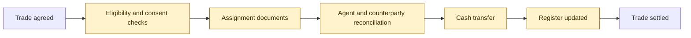
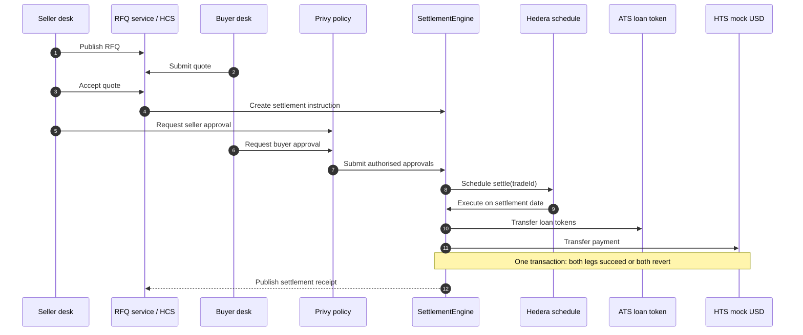
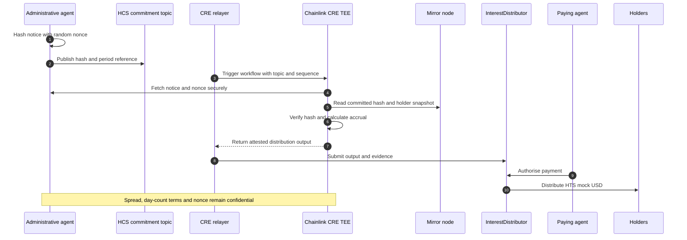
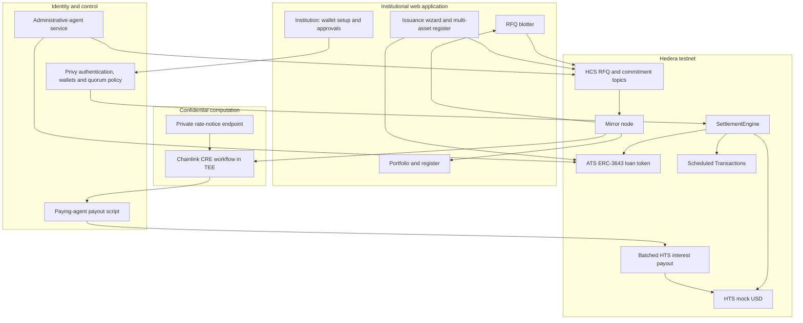
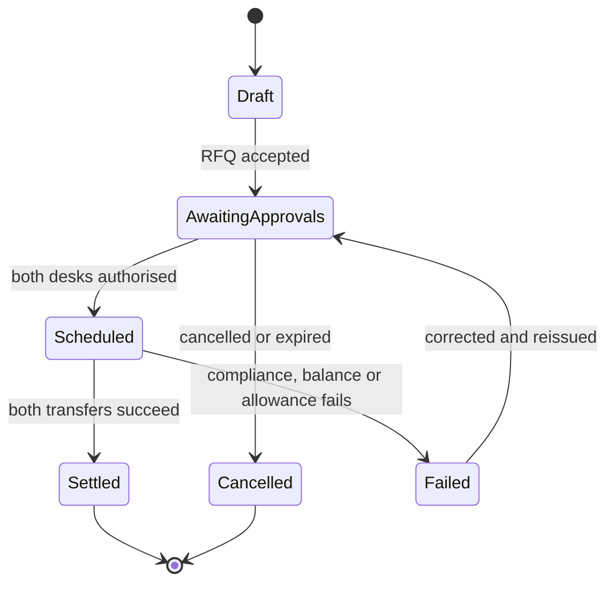
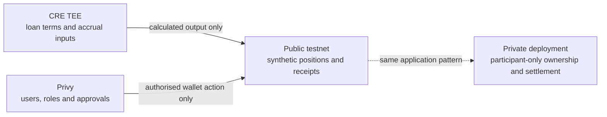

# SyndicateLend — Hackathon Product Requirements Document

**Product:** Private tokenised loan registry and secondary exchange

**Track:** Tokenisation of Anything — Asset Tokenization Studio

**Integrations:** Hedera ATS, Hedera Token Service, Hedera Consensus Service, Hedera Scheduled Transactions, Privy and Chainlink CRE

**Network:** Hedera testnet

**Team:** Solo founder (Adrija, founder of Fullmetal Finance)

**Build window:** Five days

---

## 1. Executive Summary

When a company needs to borrow more than one bank is willing to provide, several banks lend together under one credit agreement. This is a syndicated loan.

Syndicated loans form one of the world's largest credit markets. The Morningstar LSTA Leveraged Loan Index was approaching **$1.5 trillion** in outstanding loans in 2025. US secondary loan trading reached a record **$971 billion in 2025**, and trailing twelve-month volume passed **$1 trillion in the first quarter of 2026**.

Yet a loan interest is not transferred like a listed security. It is a contractual claim governed by a private credit agreement. The administrative agent maintains the lender register, the parties exchange assignment documents, eligibility and consent conditions must be satisfied, and the cash and asset legs are coordinated across separate systems. A trade can be agreed quickly while its legal and operational settlement takes days or weeks.

This delay creates avoidable counterparty exposure, traps capital and generates reconciliation work. The market even uses delayed-compensation rules to allocate interest and cost of carry when settlement misses the expected date.

I am building **SyndicateLend** to address this settlement problem. It is a private, tokenised register and request-for-quote (RFQ) exchange for syndicated loan interests. Hedera Asset Tokenization Studio (ATS) represents eligible ownership, a settlement contract exchanges the loan token and payment atomically, Privy applies institutional approval controls, and Chainlink CRE calculates interest from confidential loan terms.

### Founder and origin

I am the founder of **Fullmetal Finance**, which builds collateral and settlement-efficiency products for institutional finance, including a full-stack OTC derivatives solution covering trade capture, collateral, margining and settlement. SyndicateLend applies the same settlement discipline to syndicated loans.

The idea did not come from a tokenisation trend. In conversations about Fullmetal's OTC derivatives stack, syndicated-loan institutions in India, including **ICICI Bank, HDFC Bank and State Bank of India**, indicated interest in solutions that make syndicated loans easier to manage alongside the derivatives stack. Those signals are recorded in [docs/validation.md](docs/validation.md). They are expressions of interest, not contracts, and this document does not present them as customers.

A one-page pitch is in [PITCH.md](PITCH.md) and a Lean Canvas in [docs/lean-canvas.md](docs/lean-canvas.md).

### Product thesis

> A loan trade should not remain exposed for weeks after the buyer and seller have agreed its terms. If ownership, eligibility and payment are represented on a shared ledger, the trade can settle as one controlled transaction.

### Hackathon objective

Demonstrate the complete lifecycle of one tokenised term-loan tranche:

1. issue and allocate the loan token;
2. onboard eligible lenders;
3. negotiate a trade through an RFQ;
4. collect each institution's internal approvals;
5. settle the asset and payment together;
6. calculate and distribute interest; and
7. preserve an auditable record of every material event.

---

## 2. Problem and Market Context

### 2.1 How the market works today

An administrative agent acts as the operational centre of a syndicated facility. It maintains the lender register, circulates notices, processes assignments and distributes principal and interest. Trading is bilateral: a buyer and seller agree the economics, then complete the documentation and operational steps required by the credit agreement.



These steps are not unnecessary in themselves. The inefficiency comes from performing them across fragmented records, documents and payment rails without one shared settlement state.

### 2.2 Core problems

| Problem | Operational effect | Economic effect |
|---|---|---|
| Fragmented ownership records | Parties reconcile their positions against the agent's register | Disputes and manual exceptions |
| Separate asset and cash movements | One leg may be ready before the other | Counterparty and principal risk during settlement |
| Repeated eligibility checks | KYC, transfer restrictions and consents are reviewed for each assignment | Longer settlement and higher operating cost |
| Private interest terms | Each party calculates and reconciles accrual independently | Payment breaks and delayed-compensation claims |
| Scattered audit evidence | Messages, approvals, documents and receipts live in different systems | Slow investigation and weak real-time oversight |

For loan funds offering daily redemptions, slow settlement also creates a **liquidity mismatch**: investors can request cash daily while loan-sale proceeds arrive weeks later. Cash buffers and credit lines bridge the gap but tie up capital or add funding costs, with greater pressure when redemptions rise.

The problem is therefore not that the market lacks software. ClearPar routes documents and signatures; Loan IQ supports the agent's servicing books; Versana distributes agent-sourced data. They improve coordination without making the ownership record and cash payment one transaction. Three dependencies remain:

- **Trade agreement is not lender-of-record status.** The buyer and seller agree economics first; the agent must process the assignment and record the new lender separately.
- **Eligibility is facility-specific.** KYC and tax onboarding do not replace checks against a loan's disqualified-lender list or its borrower and agent consent requirements. A complete document package can still wait in an agent's queue or a contractual consent window.
- **Cash and servicing run on separate timelines.** Bank wires must be coordinated with assignment effectiveness, while interest-payment cut-offs can interrupt transfers. During the gap, parties reconcile positions and accrued interest, including delayed compensation where applicable.

Tokenisation can connect the register, transfer checks and payment; it cannot remove contractual consent periods or make a shadow register legally authoritative by itself.

### 2.3 Evidence of demand

**Only 29% of par loan trades settled within T+7; 27% took longer than T+20**, according to LSTA's 2021 settlement commentary. These are historical figures, not a 2026 market estimate; T+n counts business days after the trade date. [Source: LSTA, Risk Management 101](https://www.lsta.org/university/operations/).


- The LSTA reported **$971 billion** of secondary loan trading in 2025, a record and 18% above 2024.
- LSTA's April 2025 settlement review showed mean and median par settlement times still in the mid-to-high teens in business days, against a ten-year average of 20 business days.
- Versana reported more than 1,500 facilities and approximately $900 billion of commitments on its agent-connected data platform, showing institutional demand for shared loan infrastructure.
- Galaxy's $75 million tokenised CLO closing in January 2026 shows growing institutional interest in on-chain credit, although it tokenises CLO securities rather than the underlying syndicated loan assignments addressed here.

### 2.4 Target users

| User | Job to be done | Current pain |
|---|---|---|
| Credit fund or CLO trading desk | Buy and sell loan interests | Uncertain settlement date and trapped liquidity |
| Loan operations team | Complete assignments and reconcile cash | Manual follow-up and exception management |
| Administrative agent | Maintain the authoritative lender register | Re-keying, consent checks and fragmented instructions |
| Compliance officer | Approve eligible counterparties and transfers | Controls sit outside the transfer itself |
| Insurer or pension investor | Hold and occasionally trade loans | Repeated onboarding and limited position visibility |
| Auditor or regulator | Reconstruct ownership and transaction history | Evidence is distributed across several systems |

### 2.5 Why this is more than tokenised private credit

Tokenised private credit already exists: Maple and Centrifuge tokenise pool or fund exposure, Figure tokenises consumer-loan assets and their financing, and Galaxy's tokenised CLO puts a securitised note on-chain. Judges should not read SyndicateLend as another instance of that category. Those products tokenise a **wrapper around loan exposure**; the underlying loan interest still changes hands through the agent's register, assignment documents and a separate cash rail. SyndicateLend tokenises the **assignment itself** at the register level and makes the settlement of that assignment atomic and compliance-aware.

| Dimension | Tokenised private credit and CLO tokens | SyndicateLend |
|---|---|---|
| What the token represents | A share of a pool, fund or securitised note | A defined par amount of one tranche on the facility's lender register |
| Who maintains the record | The issuer of the wrapper | The administrative agent, the party that already owns the register |
| Secondary transfer | Token move; the loan behind it is untouched | The assignment is the transfer; the agent's register is the token balance |
| Eligibility | Checked at issuance or by an allow-list | Re-checked inside the settlement execution; revocation causes a full revert |
| Cash leg | Off-chain, or a stablecoin transfer with no linkage | Same transaction as the asset leg; both succeed or both revert |
| Institutional authority | One wallet, one signer | User-bound quorum wallets; the venue cannot move a desk's assets |
| Interest | Computed by the issuer, published or not | Computed from confidential terms in a TEE against a public commitment; only the distribution is released |
| Timing | Immediate, or off-platform | Scheduled by the network at the agreed settlement date from inside the contract |

The result is a product an administrative agent can run as a shadow register beside its books, which is the only realistic adoption path for an asset whose legal transfer is governed by a credit agreement.

### 2.6 India as a second market

Fullmetal Finance's institutional relationships are concentrated in India, where large corporate borrowing is dominated by consortium and multiple-banking arrangements led by the same banks that expressed interest above. Secondary trading of those loans is nascent by comparison with the US market. The Secondary Loan Market Association (SLMA) was incorporated in August 2020 by ten banks, including SBI, ICICI Bank and HDFC Bank, on the recommendation of a Reserve Bank of India task force, as a self-regulatory body to develop that market through standard documents and trading rules. A settlement layer that starts from the lead bank's register, rather than from a fund wrapper, fits that market's structure. Market-size figures for India are deliberately absent from this document until they can be cited from SLMA or Reserve Bank of India data.

---

## 3. Product Definition

### 3.1 Proposed solution

SyndicateLend provides a shared register and an RFQ-based secondary market for a tokenised loan tranche.

An **assignment** makes the buyer a lender of record with direct rights under the credit agreement. A **participation** instead passes through the economics while the seller remains the registered lender; the participant also takes exposure to the seller. The core product targets assignments. Feeder interests are a separate pass-through layer, not direct lender-of-record positions in the underlying facility.

Each ATS token represents a defined amount of principal in one tranche. For the demonstration, one token represents one US dollar of par value. The token is not intended to replace the credit agreement by itself; the legal documents must recognise the digital register and define what the token represents. The first production pilot would therefore run as a shadow register before any legally binding migration.

Only verified institutions may hold or receive the token. Once a trade is agreed and approved, the `SettlementEngine` transfers the loan token from seller to buyer and the permissioned mock-USD token from buyer to seller in one contract call. If either leg or any compliance check fails, the entire transaction reverts.

### 3.2 Value proposition

SyndicateLend is designed to reduce the interval between trade agreement and settlement from weeks to a configurable T+1 or T+0 process, while retaining the controls expected in institutional credit markets.

It does this by making four elements part of the same workflow:

- **ownership:** the ATS token balance records the digital position;
- **eligibility:** KYC and transfer rules are checked when ownership moves;
- **payment:** the asset and cash legs execute atomically; and
- **evidence:** RFQs, approvals and settlement receipts form a linked audit trail.

### 3.3 Why a shared ledger is appropriate

A conventional shared database could improve coordination, but its operator would still control the definitive record and cash would remain on a separate rail. Here, the ledger is useful for a narrower reason: both the asset and payment can be authorised, checked and transferred within one verifiable execution.

Hedera is suited to the prototype because it provides:

- ATS contracts and tooling for compliant security-token issuance;
- EVM smart contracts for the atomic settlement instruction;
- native HTS controls for the mock cash token;
- HCS timestamps and ordering for the audit trail; and
- Scheduled Transactions for deferred execution and signature collection.

### 3.4 Product principles

- Follow the market's existing RFQ structure; do not introduce a public order book.
- Keep legal and compliance controls explicit rather than treating token ownership as automatically sufficient.
- Use familiar terms in the interface: par, price, counterparty, approval and settlement date.
- Expose a receipt for every material action.
- Make privacy a deployment requirement, not an afterthought.
- Present testnet activity as a technical demonstration, not as a legally effective loan transfer.

### 3.5 What is new here

Five things in this build are, to my knowledge, not found together on Hedera or in the cross-chain comparables:

1. **In-contract scheduling with the contract as payer.** `SettlementEngine` calls the Hedera Schedule Service system contract (HIP-1215 `scheduleCall`) itself when the second approval lands, and funds the scheduled execution from its own balance. No off-chain scheduler or keeper.
2. **Revocation triggers a full revert at execution time.** The compliance officer can revoke a buyer after both desks have approved; the scheduled settlement then fails as a whole, with the ATS revert reason stored on the trade. The engine uses `transferFrom` rather than ATS `forcedTransfer` precisely so that this check cannot be bypassed.
3. **Commitment-verified confidential accrual.** The agent commits a salted hash of the private rate notice to HCS; a Chainlink CRE confidential workflow verifies the notice inside a TEE and releases only the per-holder distribution. A tampered notice aborts before any output leaves the enclave.
4. **User-bound institutional quorum.** Each desk wallet is owned by a Privy key quorum with a 2-of-3 policy limited to the venue contracts: three named staff for a named institution, or the trader, the venue's automated compliance co-signer and a per-desk reserve key for a self-service judge desk (the venue holds one key of three). The application secret alone cannot move a desk's assets.
5. **The market's own workflow.** RFQ rather than an order book, an agent-centred register rather than a fund wrapper, and settlement receipts that map to the LSTA trade lifecycle desks already run.
6. **Integration hooks into the agent's existing systems.** A reconciliation adapter ingests the agent's own register export (the shape a Loan IQ book or a Versana feed produces), marks each lender AGREES or BREAK against the ATS register, computes the agreement rate and attests only a hash of the report on HCS; an assignment exporter turns settled trades into LSTA-vocabulary records for the agent's loan system or a ClearPar-style workflow. The shadow-register pilot therefore requires no re-keying on either side.

---

## 4. User Journeys

### 4.1 Issue a facility token

1. The administrative agent creates a token for one term-loan tranche through ATS.
2. The agent records the token-to-facility mapping and governing-document reference.
3. Approved institutions complete simulated KYC and are added to the identity and eligibility controls.
4. The agent allocates tokens in proportion to each lender's opening principal position.
5. The application proves the restriction by rejecting a transfer to an unverified account.

### 4.2 Trade and settle a loan interest



The settlement instruction contains the facility, buyer, seller, par amount, price, cash amount, currency, settlement date and a reference to the accepted RFQ. It contains no confidential document text.

Before settlement, the application checks that:

- both parties approved the same instruction;
- the seller still owns and has authorised the required loan tokens;
- the buyer has sufficient authorised mock USD;
- the buyer remains eligible to hold the tranche; and
- the trade has not expired, settled or been cancelled.

### 4.3 Calculate and distribute interest

Floating-rate loans reset their interest rates, while secondary trades change lender positions. Each distribution therefore needs the applicable rate, accrual period and ownership record to determine who receives what. The demo links a private rate notice to a holder snapshot, making confidential calculation part of loan servicing rather than an isolated privacy feature.

The agent's rate notice may include private economics. The public testnet should not receive the notice itself. Instead, the agent commits to the notice by publishing a salted hash. Chainlink CRE retrieves the confidential data inside a trusted execution environment, verifies it against the commitment and calculates the amounts due.



For the hackathon, the workflow must prove that a changed notice fails verification. Production report verification and the final Hedera delivery path remain subject to the exact CRE network and attestation interfaces available during implementation.

---

## 5. Functional Requirements

### 5.1 Priority definitions

- **P0:** required for the end-to-end demonstration;
- **P1:** include if the P0 path is stable; and
- **Later:** intentionally outside the five-day build.

### 5.2 MVP requirements

| ID | Priority | Requirement | Acceptance test |
|---|---|---|---|
| FR-01 | P0 | Issue one ATS ERC-3643 token for a term-loan tranche | Token and issuance transaction are visible on HashScan |
| FR-02 | P0 | Register at least three eligible lenders | Eligible lenders can receive; an unverified account cannot |
| FR-03 | P0 | Issue a KYC-gated HTS mock-USD token | Transfer to an account without KYC fails |
| FR-04 | P0 | Create, quote and accept an RFQ | Each event appears in order with a consensus timestamp |
| FR-05 | P0 | Apply a 2-of-3 desk approval policy through Privy | One approver cannot authorise the desk wallet; two can |
| FR-06 | P0 | Create a complete settlement instruction | Both desks see identical immutable trade economics |
| FR-07 | P0 | Schedule the settlement contract call | A pending schedule and its intended execution time are visible |
| FR-08 | P0 | Exchange the loan and cash legs atomically | Both balances change or neither balance changes |
| FR-09 | P0 | Recheck eligibility during settlement | Revoking buyer eligibility before execution causes a full revert |
| FR-10 | P0 | Commit a private interest notice to HCS | HCS stores the hash, facility and period, not the notice |
| FR-11 | P0 | Verify and calculate accrual in a CRE confidential workflow | Correct input produces output; altered input aborts |
| FR-12 | P0 | Distribute interest in mock USD | Every holder receives the amount calculated from the snapshot |
| FR-13 | P0 | Provide institution wallet setup, a blotter, portfolio, multi-asset register, transfer requests, interest and payments, and approvals | A new judge can complete the guided flow without a CLI |
| FR-14 | P0 | Link material transactions to HashScan | Issue, RFQ, schedule and settlement receipts are inspectable |
| FR-15 | P1 | Demonstrate freeze and pause controls | Default freeze and amendment pause block the expected actions |
| FR-16 | P1 | Encrypt RFQ payloads | Authorised participants can read them; public observers cannot |

### 5.3 Non-functional requirements

| Area | Requirement |
|---|---|
| Security | No private key, API credential or confidential notice may be committed to the repository or ledger |
| Privacy | Only synthetic data may be used on public testnet |
| Reliability | Settlement must be idempotent and protected against replay and double execution |
| Auditability | Every application state must link to its source transaction or message |
| Usability | The end-to-end trade should take under five minutes in the guided demo |
| Accessibility | Critical state must not be conveyed by colour alone |
| Testing | Contracts cover approval, allowance, eligibility, replay and atomic-revert paths |

### 5.4 Out of scope

- primary syndication and book-building;
- legally binding production transfer of a loan interest;
- real fiat or mainnet stablecoin settlement;
- live identity verification or sanctions screening;
- borrower-consent and deemed-consent workflows;
- revolver drawdowns, amendments and waivers;
- distressed trades, participations and multi-currency facilities;
- an order book or automated matching engine; and
- production custody, HSM and disaster-recovery arrangements.

---

## 6. Technical Architecture

### 6.1 System view



### 6.2 Responsibility by component

| Component | Responsibility | Why it belongs here |
|---|---|---|
| Hedera ATS | Issue the loan token and enforce identity-based transfer controls | Reuses a security-token framework instead of creating a custom register |
| `SettlementEngine` | Store trade state and execute both settlement legs | Atomicity must sit inside one execution boundary |
| HTS mock USD | Represent the permissioned payment leg | Native KYC, freeze and pause controls mirror institutional cash restrictions |
| HCS | Order RFQ events and anchor hashes of private notices | Creates a timestamped trail without publishing the underlying notice |
| Scheduled Transactions | Hold an approved contract call until the agreed date | Supports deferred execution and network-visible status |
| Mirror node | Serve read models for the UI and CRE verification | Keeps high-volume reads away from consensus transactions |
| Privy | Authenticate users and enforce wallet-action quorum | Models the separation between trader, compliance and portfolio authority |
| Chainlink CRE | Verify committed confidential inputs and calculate accrual in a TEE | Keeps private terms outside the public ledger and application server |
| Paying agent (`ops/src/pay-interest.ts`) | Verify the released distribution against the HCS commitment and pay it in atomic HTS batches, with catch-up for holders skipped earlier | The disclosed fallback for an on-chain distributor; the trusted role is limited to delivery and every payout is receipted on HCS |
| Market tick (`web/src/lib/automated-desk.ts`) | After any API response: onboarding steps, gas float, automated signatures and co-signatures, broadcasts, settlement sync, market making | No long-lived process is needed on the hosted demo |

### 6.3 Trade state model



The contract must reject invalid transitions, repeated settlement, changed economics after approval and calls from unauthorised accounts.

### 6.4 Data model

| Record | Minimum fields |
|---|---|
| Credit agreement | name, borrower, agent bank, dated, document reference, governing law |
| Asset (one ATS security per facility or tranche) | symbol, name, synthetic ISIN, token address and id, principal, maturity, facility type, document reference, creation receipt, source (ops scripts or browser issuance), tradeable flag, allocations |
| Institution | institution ID, members and roles, Privy key quorum, policy, desk wallet, reserve-signer public key (judge desks), Hedera account, onboarding step receipts, gas top-ups, KYC and eligibility status |
| RFQ | RFQ ID, facility, side, par amount, response deadline, creator |
| Quote | quote ID, RFQ ID, counterparty, price, settlement date, expiry |
| Trade | trade ID, accepted quote hash, buyer, seller, par, cash amount, state, schedule ID |
| Interest period | facility, record date, payment date, commitment hash, HCS sequence, output hash |
| Distribution | period, holder snapshot reference, recipient, amount, payment status |

Monetary values use integers in the smallest supported unit. Prices and rates use fixed-point integers; floating-point arithmetic is prohibited in contracts.

---

## 7. Privacy, Security and Legal Boundaries

### 7.1 Privacy model



The hackathon uses public Hedera testnet so judges can inspect transactions. A production deployment cannot expose lender positions, trade prices or confidential facility terms publicly. HashSphere is the proposed private-network route because Hedera describes it as providing the same technology, services and toolkits within a private environment. This must still be validated through a production architecture review; testnet portability does not by itself prove that every operational configuration will be unchanged.

| Data | Testnet treatment | Production requirement |
|---|---|---|
| Lender identity | Fictional institution and role | Permissioned identity with minimum necessary disclosure |
| Position and trade amount | Synthetic | Private network or confidential representation |
| RFQ and quote | Synthetic plain text for demo | Encrypted payload and restricted submit/read policy |
| Credit agreement and rate notice | Never uploaded | Private document store; only hashes or references on-ledger |
| Individual approvals | Stored in Privy | Retained under institutional access and audit policy |
| Settlement receipt | Public | Visible to participants, agent and authorised supervisors |

### 7.2 Security controls

- Separate issuer, compliance, paying-agent and venue permissions.
- Bind every approval to a hash of the complete settlement instruction.
- Use nonces, expiries and settled flags to prevent replay.
- Apply checks-effects-interactions and reentrancy protection in settlement contracts.
- Recheck ATS eligibility at execution rather than relying on approval-time status.
- Hash confidential notices with a random 32-byte nonce to resist guessing.
- Verify the CRE commitment before calculation and reject mismatched inputs.
- Keep relayer authority narrow, rotate credentials and make submissions idempotent.
- Record failure reasons without logging confidential input data.

### 7.3 Legal boundary

The prototype demonstrates a technical register; it does not establish that possession of a token constitutes legal ownership of a loan. A production launch requires counsel to align the token, agent register, credit agreement, assignment documentation, perfection, custody and insolvency treatment. The proposed sequence is:

1. mirror real positions in a non-authoritative shadow register;
2. reconcile the shadow register against the agent's books;
3. obtain a legal opinion and amend the governing documents; and
4. move to an authoritative digital register for a controlled pilot facility.

---

## 8. Delivery Plan

### 8.1 Five-day plan

| Day | Deliverable |
|---|---|
| 1 | Confirm ATS deployment, Privy signing path and CRE interfaces; issue the loan and mock-USD tokens; onboard test institutions |
| 2 | Implement and test `SettlementEngine`; execute one atomic test settlement; expose HashScan receipts |
| 3 | Build the RFQ blotter, portfolio and approval inbox; connect Privy quorum; schedule an end-to-end settlement |
| 4 | Add HCS notice commitment, confidential CRE calculation and interest distribution; test altered-notice rejection |
| 5 | Add lifecycle controls, fix the highest-impact usability issues, publish documentation and record the demo |

### 8.2 Build order and fallback decisions

| Dependency | Primary path | Controlled fallback |
|---|---|---|
| Privy to Hedera | Privy EVM wallet calls contracts through Hedera JSON-RPC | Use Privy for policy-bound EVM approval only; keep native administrative transactions in the backend demo account |
| Deferred settlement | Hedera `ScheduleCreateTransaction` wrapping `ContractExecuteTransaction` with `waitForExpiry` | Execute the same contract call manually at the chosen demo time and label scheduling incomplete |
| CRE delivery | Relayer submits verifiable CRE output to `InterestDistributor` | Store and display the simulated signed/attested output, then submit through an authorised demo adapter |
| Interest payout | Contract-mediated HTS distribution to the small demo holder set | Batched Hedera SDK transfers signed by the paying agent (the path taken), with catch-up runs for holders skipped earlier |

Fallbacks must be disclosed in this document (§14.12) and in the demo. A simulated or adapted path must never be presented as a production integration.

### 8.3 Definition of done

The MVP is complete only when a judge can:

1. inspect an ATS-issued tranche and three eligible holders;
2. observe a rejected transfer to an ineligible account;
3. create, quote and accept an RFQ;
4. see that one internal approver is insufficient;
5. complete the required approvals and inspect the pending settlement;
6. execute settlement and confirm both balances changed together;
7. revoke eligibility in a second scenario and observe a full revert;
8. inspect the HCS notice commitment;
9. see a valid CRE calculation and an altered-notice rejection; and
10. confirm interest arrived in each holder's mock-USD balance.

### 8.4 Hackathon alignment

| Evaluation area | Demonstrated contribution |
|---|---|
| Asset Tokenization Studio | ERC-3643 issuance, lender eligibility, restricted transfer and lifecycle controls |
| Secondary market | Market-appropriate RFQ workflow and atomic delivery-versus-payment settlement |
| Hedera services | ATS, HTS, HCS, Smart Contract Service, Scheduled Transactions and mirror-node reads each have a defined role |
| Chainlink confidential workflow | Private notice retrieval, commitment verification and accrual calculation inside a TEE |
| Privy B2B workflow | Role-based 2-of-3 approval before an institutional wallet action |
| Product execution | A browser-based, end-to-end flow with positive and negative test cases and inspectable receipts |

### 8.5 Status at submission (updated 2026-09-13)

| Requirement | Status | Evidence |
|---|---|---|
| FR-01 to FR-04, FR-06 to FR-09 | Done on testnet | §14.3 testnet artefacts and settlement evidence |
| FR-05 Privy 2-of-3 | Done | Provisioned quorums and policies; one signature is insufficient in the app. Self-service judge desks are a genuine 2-of-3 of trader, automated compliance co-signer and a per-desk reserve key |
| FR-10, FR-11 | Done in the local CRE simulator | `cre/evidence/latest.json`; live enclave deployment needs Confidential Workflows private beta, enrolment requested |
| FR-12 Interest payout | Done via the disclosed fallback | Paying agent pays the CRE-released distribution in atomic HTS batches per asset, with `--catch-up` for holders skipped earlier; periods 2 and 3 paid on Tranche A and period 1 on the other assets; §14.8 |
| FR-13, FR-14 | Done | Institution (wallet setup as three phases, approvals), Loan registry (issue, register, transfer requests, interest & payments, administration), Secondary exchange, Positions; HashScan receipts throughout |
| Multi-asset register and browser issuance (§4.1) | Done on testnet | One credit agreement with `MHTLB-A`, `MH-RCF`, `MH-DDTL` from the ops scripts plus tranches issued from the wizard (`MHTLB-B`, `MHTLB-C`); lender pars read through `RegisterSnapshot`; docs/issuance-guide.md |
| Self-service judge desks and automated institutions | Done | Any email gets its own institution; Aldgate market-makes and Bishopsgate counterparties the transfer-request demo; docs/demo-runbook.md |
| FR-15 Freeze and pause | Done | `npm run demo:controls`; §14.8 lifecycle controls |
| FR-16 Encrypted RFQ payloads | Not done | RFQ messages are synthetic plain text on the public topic |
| Shadow-register integration (§10.3) | Done | Register reconciliation with HCS attestation and LSTA-style assignment export; §14.10 |
| Retail feeder holders on public network (§9.5) | Done on testnet | 25 holders onboarded as KYC-gated register positions in 150 transactions; paid in period 3 in four atomic batches; §14.11 |

One Privy desk wallet (Halcyon) has not yet executed its mock-USD association intent, so the payout script skips it with the reason recorded on the HCS receipt until its quorum signs; a catch-up payout then pays it. Meridian's earlier skip is settled the same way. This is a demo-provisioning gap, not a design limitation. Desk wallets on testnet are kept above 8 HBAR by the operator so their Privy-signed transactions can reserve gas.

---

## 9. Validation and Success Measures

### 9.1 Hackathon success metrics

| Measure | Target |
|---|---|
| End-to-end settlement completion | 100% on the documented happy path |
| Partial settlement incidents | 0 |
| Negative-path contract tests | Approval, allowance, eligibility, replay and notice mismatch all pass |
| Guided demo completion time | Under five minutes |
| Practitioner reviews | At least three loan-market or operations practitioners |
| Structured test-user responses | At least five |
| Changes made from feedback | At least two, recorded in the README |

### 9.2 Pilot metrics

The post-hackathon pilot should measure outcomes rather than network activity alone:

- median time from trade agreement to settlement readiness;
- number and age of unmatched exceptions;
- time spent reconciling agent and counterparty records;
- failed settlements by cause;
- delayed-compensation events avoided;
- cash and collateral held while awaiting settlement; and
- agreement rate between the shadow register and the agent's books.

### 9.3 Validation plan

During the hackathon, three groups should review the product:

| Reviewer | Question |
|---|---|
| Loan trader or operations practitioner | Does the RFQ-to-settlement sequence reflect the real desk workflow? |
| ATS, Privy and Chainlink engineers | Are the integrations being used as intended, and which assumptions remain? |
| Test user unfamiliar with the project | Can the trade be completed without crypto-specific guidance? |

Feedback should be recorded as: observation, evidence, decision and resulting change. Placeholder endorsements must not appear in the pitch.

### 9.4 Validation record

[docs/validation.md](docs/validation.md) holds every recorded signal in the observation, evidence, decision and change format. At submission it contains: the Indian bank interest described in §1 and §2.6, and seven evidence-driven engineering changes from testnet incidents. The practitioner-review target in §9.1 is not yet met, and the record says so.

### 9.5 Network impact

Each institution becomes a Hedera account, every trade produces HCS messages and scheduled contract executions, and every accrual period produces consensus transactions. The README's "Network impact" section gives the per-institution, per-trade and per-period transaction counts and a worked example for one agent's book. A HashSphere deployment keeps the same transaction shape.

The measure that matters for institutional flow is value, not throughput. On the README's assumptions, one agent's 200-facility book puts US$120bn of loan par on the register, settles US$4bn of secondary notional and pays US$8.7bn of interest through the network per year, at roughly US$4m of value per settlement or payout transaction; at Versana scale those figures are US$900bn, US$30bn and US$65bn. The cash leg requires that money to sit in a regulated payment token on the same ledger, and an on-register loan position with atomic settlement becomes collateral that can be pledged for secured funding or OTC derivatives margin on that ledger, which is Fullmetal Finance's existing business. That collateral pool is orders of magnitude larger than any retail flow a network can attract, and it arrives through a few thousand institutional accounts.

The intended topology is two layers with one transaction shape: the institutional core (register, RFQ market, settlement between institutions) on HashSphere, because positions and prices cannot be public, and retail feeder holders on public Hedera, because retail custody and transferability need the public network. The feeder is the bridge: one institutional lender on the HashSphere register and the issuer of many small positions on the public network. Public-network account growth therefore comes from the retail layer, and it is built: `ops/src/feeder-demo.ts` onboarded 25 feeder holders on public testnet as KYC-gated register positions (150 transactions), the enclave took the 30-holder snapshot in one call through the `RegisterSnapshot` helper, and the payout credited 28 holders in four atomic batches. The README extrapolates that to a labelled scenario (one in ten facilities with a 5,000-holder feeder) of about 750,000 accounts and 9m interest transfers a year.

---

## 10. Business Model and Adoption

### 10.1 Initial customer

The initial buyer is a CLO manager or credit fund with frequent secondary trading and a loan-operations team that bears the cost of delayed settlement. The administrative agent is the essential system partner because it controls the official lender register.

Fullmetal Finance's route to that partner runs through its existing OTC derivatives relationships: the collateral and settlement desks that use the derivatives stack sit next to the loan-operations and agency desks that SyndicateLend serves. The Indian banks that indicated interest are both lead banks on consortium facilities and derivatives counterparties, so one relationship covers both roles.

### 10.2 Commercial model

Potential revenue streams are:

- a settlement fee per completed trade;
- a facility onboarding and integration fee;
- an annual register-maintenance fee; and
- an interest-distribution service fee.

Pricing is not validated in the hackathon and should not be presented as established market willingness to pay.

### 10.3 Adoption path

1. Run a shadow-register pilot with one buy-side institution and one administrative agent.
2. Compare the tokenised workflow with the same real-world operational process.
3. Integrate with existing sources such as agent-bank systems, ClearPar or Versana rather than asking users to re-enter data. The reconciliation and assignment-export adapters in `ops/` are the first two such hooks and run against the testnet register today.
4. Establish the legal basis for the digital register on one facility.
5. Expand across facilities administered by the same agent.

### 10.4 Competitive position

| Category | Strength | Remaining gap addressed by SyndicateLend |
|---|---|---|
| ClearPar | Established settlement workflow and documentation | Atomic exchange of a digital loan position and payment |
| Loan IQ | Agent-bank servicing and books of record | A participant-verifiable cross-institution register |
| Versana | Normalised, real-time agent data | Transfer and settlement of ownership |
| Tokenised CLOs | On-chain issuance of securitised credit exposure | Tokenisation and transfer of the underlying syndicated loan interest |

SyndicateLend should be positioned as a settlement layer that can integrate with these systems, not as a claim that their functions are unnecessary.

### 10.5 Lean Canvas

The nine-box canvas is in [docs/lean-canvas.md](docs/lean-canvas.md).

### 10.6 First pilot target and what it costs the customer

**Profile.** The agency desk of one Indian private-sector bank acting as lead bank on one term-loan facility with three to six lenders, run as a shadow register for one quarter. A CLO manager or credit fund is the second party in the US variant of the same pilot.

**What the customer commits.**

- A read-only feed of the lender register for the pilot facility (a spreadsheet export is sufficient on day one).
- Two operations staff for roughly two hours a week to enter trades in parallel and review the daily reconciliation.
- Sign-off from compliance on synthetic-data use during the shadow phase; no legal amendment until the register agrees with the books for a full quarter.

**What SyndicateLend provides.** A hosted private deployment (HashSphere or an equivalent permissioned Hedera network), institution provisioning, the daily reconciliation report and the pilot metrics in §9.2. No integration with the bank's core loan system is required for the shadow phase.

**Pricing hypothesis.** A flat pilot fee that converts to per-trade settlement and per-facility register fees on migration. The number is not stated here because it has not been tested with a buyer.

---

## 11. Risks and Open Questions

| Risk or question | Impact | Response |
|---|---|---|
| Token does not constitute legal title | Product cannot become the official register | Begin with a shadow register and obtain facility-specific legal analysis |
| Borrower or agent consent remains off-platform | Settlement cannot be fully automated | Add configurable consent states and time windows after the MVP |
| Privy cannot sign a required Hedera-native transaction | Approval flow breaks | Keep user actions on the EVM path and test this dependency on day one |
| CRE attestation or Hedera write path differs from the design | Interest delivery is not end to end | Prove confidential calculation first and isolate delivery behind a small adapter |
| Public testnet exposes transaction data | Demo could model an unsafe production design | Use synthetic data and show the private deployment boundary explicitly |
| Payment token is not commercial bank money | Atomicity is demonstrated without removing real cash risk | Treat mock USD as a test instrument; evaluate regulated stablecoin or tokenised deposit later |
| Scheduled execution fails because funds or eligibility changed | Trade misses settlement date | Recheck preconditions, report a precise failure and require a newly approved instruction |
| Five-day scope is too broad for one builder | Core flow may be unstable | Complete issuance and atomic settlement before confidential interest and P1 controls |

Open design questions for practitioner review:

- Which party should be authorised to create and cancel a settlement instruction?
- At what point should borrower and agent consent become final?
- Is T+1 a meaningful target, or should the product settle immediately once all conditions are met?
- Should the register represent assignments, participations or both?
- What evidence must an agent retain outside the ledger for a legally effective transfer?

---

## 12. Demonstration Narrative

The five-minute demo should tell one story:

1. A $5 million loan trade is agreed quickly but normally remains operationally exposed while documents, eligibility, cash and the agent register are coordinated.
2. The agent issues a synthetic facility through ATS and approves three lenders.
3. A seller requests a quote and accepts a buyer's price.
4. The buyer's trader cannot act alone; the required Privy quorum authorises the desk wallet.
5. The approved settlement appears as a scheduled transaction.
6. At execution, the loan tokens and mock USD move together. A second trade fails completely after buyer eligibility is revoked.
7. The agent publishes a hash of a private interest notice. CRE verifies the notice confidentially, calculates the distribution and rejects a modified notice.
8. Holders receive mock USD, and the application links the complete trail to Hedera records.

The pitch narrative (problem, solution, what is new, validation, business model, ask) is written out in [PITCH.md](PITCH.md).

The closing claim should remain precise:

> SyndicateLend demonstrates that a compliant loan register, institutional approvals, confidential interest calculation and atomic settlement can operate as one workflow. The next step is a shadow-register pilot with an administrative agent and a loan investor.

---

## 13. Research Sources

Market figures and product claims in this PRD were checked against the following primary or first-party sources on 10 September 2026 (sources 12–13 on 12 September 2026):

1. [LSTA — 1Q26 Secondary Trading and Settlement Study](https://www.lsta.org/content/secondary-trading-settlement-study-first-quarter-2026/) — reports $971 billion of secondary trading in 2025 and the subsequent trailing-twelve-month milestone.
2. [LSTA — 2Q25 Secondary Loan Trading Volumes](https://www.lsta.org/content/lsta-secondary-trading-monthly-executive-summary-2q25-secondary-loan-trading-volumes-spike-again-to-a-record-262-billion/) — reports index outstandings approaching $1.5 trillion and 2025 trading activity.
3. [LSTA — April 2025 market overview](https://events.lsta.org/app/uploads/2025/04/Welcome-Address-09Apr25.pdf) — mean and median par settlement-time history and the ten-year average.
4. [Versana — 1,500-facility milestone](https://versana.io/versana-surpasses-major-milestone-with-more-than-1500-syndicated-loan-facilities-now-available-on-its-transformative-digital-data-platform/) — approximately $900 billion of commitments on the platform.
5. [Galaxy — Initial closing of tokenised CLO](https://investor.galaxy.com/news-releases/news-release-details/galaxy-announces-initial-closing-debut-tokenized-clo-75-million) — $75 million closing announced in January 2026.
6. [Hedera — Asset Tokenization Studio](https://docs.tokenization-studio.hedera.com/) — ATS compliance, token operations and distribution capabilities.
7. [Hedera — Scheduled Transactions](https://docs.hedera.com/hedera/core-concepts/scheduled-transaction) — signature collection, expiry execution and supported transaction types.
8. [Hedera — HashSphere](https://hedera.com/product/hashsphere/) — private deployment model and available Hedera services and tooling.
9. [Privy — Quorum approvals](https://docs.privy.io/controls/common-use-cases/quorum-approval) — threshold authorisation for wallet actions.
10. [Chainlink — Confidential Workflows](https://chain.link/privacy) — TEE-based confidential inputs and computation in CRE.
11. [LSTA — Delayed Compensation Regime](https://www.lsta.org/content/the-lsta-delayed-compensation-regime/?ind=0&wpdmdl=1172) — operating rules for allocating economics after delayed settlement.
12. [SLMA — About the Secondary Loan Market Association (India)](https://www.slma.in/page/about-slma) — incorporated August 2020 by ten banks including SBI, ICICI Bank and HDFC Bank, following the RBI task force on a secondary market for corporate loans.
13. [LSTA — Risk Management 101: Reduce Settlement Times (Operations)](https://www.lsta.org/university/operations/) — 2021 commentary reporting 29% of par trades within T+7 and 27% beyond T+20. The chart's 44% middle bucket is the remainder of those rounded percentages.

---

## 14. Engineering record (moved from the README)

The README keeps the overview, links, setup and repository map. Everything below is the detailed build record: evidence tables, run orders, integration notes and the network-impact analysis. Sections are verbatim from the README as it stood at submission, with headings renumbered.

### 14.1 What is new here (from the README)

An **assignment** makes the buyer a lender of record. A **participation** passes through the loan's economics while the seller remains on the register, leaving the participant exposed to the seller as well as the borrower. SyndicateLend targets the underlying assignment, not just a pass-through claim.

Tokenised private credit (Maple, Centrifuge, Figure, tokenised CLOs) wraps *exposure* to loans in a token; the loan still settles the old way behind the wrapper. SyndicateLend tokenises the **assignment itself** on the agent's register and makes its settlement atomic and compliance-aware. Specifically:

1. **In-contract scheduling, contract as payer.** The engine calls HSS `scheduleCall` (HIP-1215) itself on the second approval and funds the scheduled execution. No keeper.
2. **Revocation triggers a full revert at execution.** Compliance can revoke a buyer after both approvals; the scheduled settlement fails as a whole with the ATS reason stored on-chain. `transferFrom`, not `forcedTransfer`, so the check cannot be bypassed.
3. **Commitment-verified confidential accrual.** Salted hash on HCS; Chainlink CRE verifies the private notice in a TEE and releases only per-holder amounts; a tampered notice aborts.
4. **User-bound institutional quorum.** Privy key quorums own each desk wallet under a policy limited to the venue contracts (2-of-3 named staff for the institutions in the video; 2-of-3 of trader, automated compliance co-signer and a reserve key for self-service judge desks); the app secret alone cannot move assets.
5. **The market's own workflow.** RFQ, not an order book; an agent-centred register, not a fund wrapper.
6. **Integration with the agent's book, not around it.** A register-reconciliation adapter that ingests the agent's own export and attests only a report hash on HCS, and an LSTA-vocabulary assignment export, so the shadow-register pilot needs no re-keying. See "Integration hooks" below.

The comparison table is in [HACKATHON-PRD.md §2.5](HACKATHON-PRD.md#25-why-this-is-more-than-tokenised-private-credit).

### 14.2 The web app in detail

The app has four workspaces: **Institution** (the desk's Privy wallet, its 2-of-3 approval policy and team, and wallet setup shown as three phases: network setup by the agent bank, the desk's three signatures, funding), **Loan registry** (the agent bank's view: one credit agreement, every asset issued under it, each asset's lenders and interest, transfer requests, interest and payments, administration), **Secondary exchange** (execution room, RFQ trading and desk approvals) and **Positions** (a desk's par by asset, cash, trades and accruals).

The agent-bank walkthrough is four browser steps, no terminal ([docs/loan-registry-demo.md](docs/loan-registry-demo.md)):

1. **Issue an asset.** The wizard creates a new ATS security under the Meridian Holdings credit agreement, allowlists and KYC-checks each syndicate lender, issues its par, and commits the private rate notice as a salted hash on HCS. Every step shows its Hedera receipt.
2. **Loan register.** The new asset appears at the top beside the assets already on the register: the pre-issued Term Loan B Tranche A (`MHTLB-A`), the revolver (`MH-RCF`) and the delayed-draw facility (`MH-DDTL`) from `ops/deployments/testnet.json`, plus every tranche issued earlier from the wizard (Tranches B and C at the time of writing). Each shows its lender register read live from the ATS security through `RegisterSnapshot`. The agent bank is always the platform's operator account; the signed-in institution is a syndicate lender on the assets it holds.
3. **Approve a transfer.** One click asks two automated institutions to agree a US$1m assignment on the HCS market; the agent bank reviews and approves it; both institutions sign with their own automated Privy quorums; the Hedera Schedule Service settles both legs.
4. **Interest.** Every asset carries a committed rate notice; the register shows the CRE-released amounts and payout receipts per lender, or the agent bank's estimate until the next confidential run. **Interest & payments** (`/lifecycle`) puts the released distribution and payout first (computed, paid, outstanding, receipts, one row per holder with the 25 retail feeder wallets grouped), then the five-stage confidential pipeline and the commitment and simulation evidence.

The hosted app is at <https://syndicatelend.fullmetal.finance> (Vercel with an Upstash Redis store seeded from the development records; checklist in [docs/demo-runbook.md](docs/demo-runbook.md#hosting-checklist-vercel)). Any email can sign in and gets its own institution at once. Its Privy key quorum is 2-of-3: the signed-in trader, the venue's automated compliance co-signer (a server-held P-256 key) and a reserve key minted for that desk (public half only, so the venue holds one key of three and can never execute alone). The judge signs once in the browser, the venue co-signs after checking the intent, and the wallet policy still limits everything to the venue contracts. The named institutions in the video keep their 2-of-3 human quorums. The operator side of Hedera onboarding runs automatically from any page load. An automated liquidity desk (Aldgate, two server-held keys, labelled as automated) always has a buy and a sell RFQ open, quotes within a minute, accepts the best quote it receives and approves its own side, so a judge can also trade end to end. A configured email group gets a **Reset desk** button for iterating. See [docs/demo-runbook.md](docs/demo-runbook.md).

Every on-chain claim below is also reproducible without a login from the `ops/` scripts against the committed ids in `ops/deployments/testnet.json`, and every artefact links to HashScan. CI runs the 21 Foundry tests, `tsc --noEmit` for ops and web, eslint, and the 36 TypeScript unit tests in `web/scripts/*.test.mts` on each push.

### 14.3 Testnet artefacts and settlement evidence

| Artefact | Id | Inspect |
|---|---|---|
| Term Loan B Tranche A `MHTLB-A` (ATS bond-type security, Reg S, whitelist + internal KYC; the tranche wired to the secondary market) | `0.0.10459721` / `0x1600f4a4609b9e9c48c432a16732da2634b7b1b7` | [HashScan](https://hashscan.io/testnet/contract/0.0.10459721) |
| Revolving Credit Facility `MH-RCF` (ATS security, 60,000,000 par, register-only) | `0.0.10520474` / `0xbfb63219860760f570723ee1dba9873cd9723f7f` | [HashScan](https://hashscan.io/testnet/contract/0.0.10520474) |
| Delayed Draw Term Loan `MH-DDTL` (ATS security, 40,000,000 par, register-only) | `0.0.10520523` / `0x715d682dc4bd7e73a1919b6929361bc771c6b348` | [HashScan](https://hashscan.io/testnet/contract/0.0.10520523) |
| Tranches issued from the browser wizard (`MHTLB-B`, `MHTLB-C`, …) | recorded per issuance in the app's durable store | listed with receipts on the Loan register |
| SettlementEngine (Sourcify exact match) | `0.0.10460134` / `0x593D401cF80FAE8422a5aA113075cD2F464c297F` | [HashScan](https://hashscan.io/testnet/contract/0.0.10460134) |
| Mock USD (HTS, KYC / freeze / pause keys) | `0.0.10459660` | [HashScan](https://hashscan.io/testnet/token/0.0.10459660) |
| HCS RFQ topic | `0.0.10459663` | [HashScan](https://hashscan.io/testnet/topic/0.0.10459663) |
| HCS notice-commitment topic | `0.0.10459666` | [HashScan](https://hashscan.io/testnet/topic/0.0.10459666) |
| Administrative agent | `0.0.10457020` | [HashScan](https://hashscan.io/testnet/account/0.0.10457020) |
| RegisterSnapshot (one-call holder balances for the enclave) | `0x33687eBC6C3f8A89DbE60ADc3E631149dA6E0690` | [HashScan](https://hashscan.io/testnet/contract/0x33687eBC6C3f8A89DbE60ADc3E631149dA6E0690) |

#### Settlement evidence (Day 2 core, same day)

| Scenario | Result | Evidence |
|---|---|---|
| Trade 1: 5,000,000 par @ 99.00 for 4,950,000 mUSD, both desks approved, executed by the network's scheduled call at `settleAt` | **Settled**, both balances moved in one transaction | [schedule 0.0.10460165](https://hashscan.io/testnet/schedule/0.0.10460165), [seller approval that created the schedule](https://hashscan.io/testnet/transaction/0x47f5ef71d24a1bb98cc417d39aa968d0f1c9ab632f12e88e1bdd41c603272ae2) |
| Trade 2: 50,000 par, buyer eligibility revoked by the compliance officer after both approvals | **Failed**, no balance changed, reason `AccountIsBlocked(buyer)` stored on-chain | [schedule 0.0.10460221](https://hashscan.io/testnet/schedule/0.0.10460221), [revocation](https://hashscan.io/testnet/transaction/0x4a80a85584441082f60f6da79222bfa7b9a536794a8de7deba60957ebe0ebf53) |

Reproduce with `npm run settle-demo -- --delay 120` and `npm run settle-demo -- --par 50000 --delay 90 --revoke-buyer` in `ops/`. The first engine deployment (`0.0.10459674`) exposed a timing edge: the network fires a schedule at its expiry second, but the EVM block timestamp can lag it by a fraction, so the engine now schedules `settleAt + 10s` (never earlier than `settleAt`). That trade was settled manually and is kept as a record.

Three eligible lenders hold the tranche (seller 150m par, holder 100m par, buyer 0 par with 10m mock USD). Restriction evidence: a [loan transfer to an unverified account reverted](https://hashscan.io/testnet/transaction/0xd59ce30c7a35ed6ba2bd71a48735dcfaa986c9d649c12e5f6b95550e819b6255) and a mock-USD transfer to it failed with `ACCOUNT_KYC_NOT_GRANTED_FOR_TOKEN`. ATS also refused to issue to the desks before they were whitelisted. Reproduce with `npm run negative-test` in `ops/`.

### 14.4 Five-minute recording flow

The web app opens on an **Execution room** that combines the current RFQ, Privy quorum progress, Hedera schedule, ATS register and CRE lifecycle status. Keep a second terminal running the counterparty agent during the recording; it watches the real HCS topic and responds to any open RFQ from another institution:

```bash
# terminal 1
cd web && npm run dev

# terminal 2, from the repository root
npm run demo:counterparty -- --institution halcyon --price 99.00
```

Recommended recording flow:

1. Sign in as Meridian's trader and show the ATS security and eligible-holder register.
2. Publish a $5m sell RFQ. The counterparty terminal detects it and Halcyon appears as a priced response on the HCS-backed blotter.
3. Accept the quote. The Execution room now shows the immutable instruction and two institutional mandate lanes.
4. Open each institution's real Privy members in separate browser profiles and demonstrate that one signature is insufficient, while the second executes the desk intent.
5. Show the resulting Hedera scheduled transaction and atomic loan/mUSD settlement receipt.
6. Open **Interest & payments** to show the released distribution and payout, the public HCS commitment, the valid calculation and the altered-notice rejection. Run `npm run demo:cre` beforehand to capture the simulation results for this screen.

The counterparty process submits RFQ quotes only. It cannot authorize either desk wallet and does not bypass Privy's user-bound 2-of-3 policy.

### 14.5 Day 1 run order (Hedera foundation)

All scripts are idempotent and record their outputs in `ops/deployments/testnet.json`.

```bash
cd ops
npm run whoami                    # resolves 0.0.x id for the operator, checks balance
npm run gen-desks                 # local ECDSA keys for the demo desks (appended to .env)
npm run deploy:usd                # HTS mock USD with KYC / freeze / pause / supply keys
npm run topics                    # HCS topics: RFQ events, notice commitments

# Settlement engine (funded with HBAR to pay its own scheduled executions)
cd ../contracts && source ../.env && forge script script/DeploySettlementEngine.s.sol \
  --rpc-url hedera_testnet --broadcast --private-key $OPERATOR_PRIVATE_KEY
cd ../ops && npm run record-engine -- --address <engine address>
# verification: forge verify-contract <addr> src/SettlementEngine.sol:SettlementEngine --chain-id 296 --verifier sourcify --verifier-url https://sourcify.dev/server --constructor-args $(cast abi-encode "constructor(address,address)" $OPERATOR_EVM_ADDRESS $OPERATOR_EVM_ADDRESS)
# note: send relay transactions from one account sequentially; Hedera's relay rejects overlapping nonces

cd ../ops
npm run issue                     # ATS bond-type security via the 8.0.0 factory + roles + whitelist
npm run onboard -- --name "Meridian Credit Partners" --role seller --evm $DESK_SELLER_EVM_ADDRESS --usd 0 --key $DESK_SELLER_PRIVATE_KEY
npm run onboard -- --name "Halcyon Loan Fund IV"     --role buyer  --evm $DESK_BUYER_EVM_ADDRESS  --usd 10000000 --key $DESK_BUYER_PRIVATE_KEY
npm run onboard -- --name "Northgate Insurance"      --role lender --evm $DESK_LENDER3_EVM_ADDRESS --usd 1000000 --key $DESK_LENDER3_PRIVATE_KEY
npm run onboard -- --name "Unverified account"       --role outsider --evm $DESK_OUTSIDER_EVM_ADDRESS --no-kyc --hbar 5
# (--key lets the script sign the HTS token association for the desk; a Privy wallet instead calls the token's associate() facade)
npm run eligibility -- --evm $DESK_SELLER_EVM_ADDRESS  --grant
npm run eligibility -- --evm $DESK_BUYER_EVM_ADDRESS   --grant
npm run eligibility -- --evm $DESK_LENDER3_EVM_ADDRESS --grant
npm run allocate -- --evm $DESK_SELLER_EVM_ADDRESS  --par 150000000
npm run allocate -- --evm $DESK_LENDER3_EVM_ADDRESS --par 100000000
npm run negative-test             # on-chain rejections for the unverified account
npm run raise-cap -- --max 1000000000   # upsize the tranche (CAP role + setMaxSupply) so new desks can be allocated par
npm run issue-tranche -- ...             # further ATS securities under the same credit agreement (MH-RCF, MH-DDTL were issued this way)
npm run allocate-asset -- ...            # allocate par on one of those assets
npm run settle-demo -- --delay 120                        # live atomic DvP via HSS schedule
npm run settle-demo -- --par 50000 --delay 90 --revoke-buyer   # full revert after eligibility revocation
```

### 14.6 How the ATS SDK is used from a backend

The SDK ships browser and custodial wallet adapters only. `ops/src/lib/ats.ts` drives it from Node the same way the SDK's own integration tests do: the MetaMask adapter is initialised in debug mode and an ethers `Wallet` is injected as the signer. Token creation, roles, control list, issuance and reads go through the SDK facades (`Bond`, `Role`, `Security`, `Kyc`, `SsiManagement`). Internal KYC grants call the diamond's `grantKyc` directly because the SDK path requires a Terminal3 verifiable credential.

Deployed ATS infrastructure used (testnet, compatible with SDK 8.0.0): BusinessLogicResolver `0.0.9212226`, Factory `0.0.9213391`, bond configuration id 2.

### 14.7 Institutional approvals with Privy

The web app in `web/` is a Next.js 16 application. Staff sign in with Privy (email or Google). A named institution is provisioned as:

- three Privy users tagged with `institution` and `role` (trader, compliance officer, portfolio manager),
- a **key quorum** of those users with threshold **2 of 3** (a self-service judge desk instead gets a quorum of its trader, the venue's automated compliance co-signer key and a reserve P-256 key minted for that desk with only its public half kept, also threshold 2),
- a **policy** owned by the quorum that only allows `eth_signTransaction` to the settlement venue contracts on Hedera testnet with zero value,
- a **desk wallet** owned by the quorum and governed by the policy.

A desk action (for example approving a settlement instruction) is an **intent** on the desk wallet. A trader or portfolio manager proposes it, and each approver authorises with their own login session: the browser signs the intent payload with the member's Privy user key (server-side token exchange is the fallback). When two members have signed, Privy executes the action and the venue broadcasts the signed transaction to Hedera. The app secret alone cannot move the wallet, and the server never holds a human desk key.

Broadcasting is deliberately conservative: each intent takes the wallet's first unreserved nonce (never highest + 1, so a rejected approval cannot leave a permanent gap), `broadcast()` looks up the receipt of the signed transaction's hash before and after sending, a relay timeout is reported as pending rather than failed, and a relay rejection for insufficient HBAR is reported as such. The market tick keeps every desk wallet above 8 HBAR (topping up 20 HBAR from the operator) because a Privy-signed transaction reserves gasLimit × maxFee, about 6 HBAR at the relay's price, before it executes.

```bash
cd web
npm run dev                                   # http://localhost:3000, uses ../.env (symlinked)
npx tsx scripts/provision.mts <id> "<name>" <trader@> <compliance@> <pm@>   # provision an institution
npx tsx scripts/intent-test.mts <id>          # create a test intent and print it
npx tsx scripts/provision-automated-desk.mts <id> "<Name>" [--demo-counterparty]   # automated institution (two server-held keys)
npx tsx scripts/hedera-onboard.mts <id> status|sync|fundUsd <amount>          # Hedera onboarding by hand; the market tick does this automatically
npx tsx scripts/market-tick.mts               # one market tick (onboarding, gas float, automated signatures, broadcasts, settlement sync)
node --import tsx --test scripts/*.test.mts   # offline tests: nonce allocation, approvals, assignments, issuance, keys, reset, register interest
```

#### RFQ market and settlement between Privy desks (Day 3)

- RFQ, quote, acceptance, instruction, approval and settlement events are JSON messages on the HCS RFQ topic; the blotter is a read model folded from the topic.
- Accepting a quote creates the settlement instruction on the engine (venue key) and proposes one approval intent to each desk. When a desk's quorum executes, the venue broadcasts the signed `approve` to Hedera; the second approval schedules the atomic settlement.
- Desk wallets join Hedera from the market tick that runs after any API response (or by hand with `web/scripts/hedera-onboard.mts`): operator steps (fund 10 HBAR, eligibility, allocate US$10m par on Tranche A, mock-USD KYC and US$15m cash) and three desk-signed steps proposed together as quorum intents (mock-USD association via HIP-719, standing loan-token and cash authorisations to the engine). The Institution page shows the three phases and the three signature tiles, and a failed step offers **Recover approval** ([docs/onboarding-recovery.md](docs/onboarding-recovery.md)).

Dashboard settings that complete the B2B setup (allowlist, MFA, login methods, app clients, webhooks) are listed in [docs/privy-dashboard.md](docs/privy-dashboard.md). Provisioned institutions are recorded in `web/data/org.json`.

### 14.8 Confidential interest calculation with Chainlink CRE

Floating-rate loans reset their interest rates, and trading changes lender positions. Servicing therefore requires both the applicable rate terms and an ownership record to determine each holder's payment. CRE connects the private rate notice to the register snapshot, calculating the distribution without publishing the underlying terms.

`cre/interest-accrual` is a CRE Confidential Workflow (TypeScript, `handlerInTee`). The agent commits a salted hash of its private rate notice to the HCS notices topic; inside the enclave the workflow fetches the notice with a Vault DON secret, verifies it against the commitment, reads every holder's balance from the ATS register in one call through `RegisterSnapshot`, and reports only the per-holder distribution. A tampered notice aborts the run. The enclave makes three HTTP requests per period regardless of holder count (topic, notice, snapshot), and reassembles HCS messages that the network chunked above 1,024 bytes. See [cre/README.md](cre/README.md).

#### Interest payout (FR-12)

`npm run demo:cre` runs the confidential simulation for every asset on the register and captures each workflow's *released* output (commitment, period, holders, amounts; no rate, basis or nonce) in `cre/evidence/distributions/<SYMBOL>.json` (the first tranche also keeps the legacy `distribution.json`). `npm run demo:payout -- --facility <SYMBOL>` (`ops/src/pay-interest.ts`) checks that commitment against the HCS notices topic, checks each holder can receive mock USD, mints the period's interest to the paying agent (the borrower's payment, modelled on the test token), credits eligible holders in **atomic HTS transfers of up to nine credits each** (the network's per-transaction cap), publishes an `interest-payout` receipt on the notices topic and writes `cre/evidence/payouts/<SYMBOL>.json`. Holders it had to skip (no par at payout time, mock USD not yet associated, KYC not granted) are listed with the reason; `--catch-up` later pays only those holders and merges them into the same period's receipt, so nobody is paid twice. The Loan register and the Interest & payments page read these files. First run on testnet for period 2 (7.25%, 30 days, five-holder snapshot):

| Step | Evidence |
|---|---|
| Commitment for period 2 | [HCS #2 on 0.0.10459666](https://hashscan.io/testnet/topic/0.0.10459666), commitment `0xe1b1…338f` |
| CRE valid run | 5 holders, 30 days, total 1,510,416.67 mUSD computed; `cre/evidence/distribution.json` |
| CRE tamper run | aborted: `notice does not match the committed hash for period 2` |
| Mint to paying agent | [0.0.10457020-1789160129-193752727](https://hashscan.io/testnet/transaction/0.0.10457020-1789160129-193752727) |
| Atomic payout, 3 holders, 906,249.99 mUSD | [0.0.10457020-1789160134-460654518](https://hashscan.io/testnet/transaction/0.0.10457020-1789160134-460654518): Meridian 241,666.66, Halcyon 60,416.66, Northgate 604,166.66 |
| Payout receipt | [HCS #3 on 0.0.10459666](https://hashscan.io/testnet/topic/0.0.10459666), lists paid and skipped holders |

Second run for period 3, after 25 retail feeder holders joined the register (see "Retail feeder holders on public testnet" below): 30-holder snapshot in one enclave call, 28 holders paid in four atomic batches, commitment at [HCS #5–6](https://hashscan.io/testnet/topic/0.0.10459666) (chunked by the network above 1,024 bytes), receipt at HCS #8. Batch links: [1](https://hashscan.io/testnet/transaction/0.0.10457020-1789166208-497320803), [2](https://hashscan.io/testnet/transaction/0.0.10457020-1789166209-592044415), [3](https://hashscan.io/testnet/transaction/0.0.10457020-1789166207-312099538), [4](https://hashscan.io/testnet/transaction/0.0.10457020-1789166210-911781675). Each feeder holder received 6.04 mUSD on 1,000 par.

Two holders were skipped in both runs with the reason on the receipt: the Halcyon Privy desk wallet held no par at the time, and the Meridian Privy desk wallet's mock-USD association intent had not yet been executed by its quorum. Meridian's quorum has since executed it and Halcyon now holds par, so `npm run demo:payout -- --facility MHTLB-A --catch-up` pays Meridian at once and Halcyon as soon as its quorum signs the association on the Institution page. Since 2026-09-13 the same workflow has run for every asset on the register (`MH-RCF`, `MH-DDTL`, `MHTLB-B`, `MHTLB-C`), with per-asset distributions and payouts under `cre/evidence/`. This is the PRD's disclosed fallback (batched HTS transfers signed by the paying agent) rather than an on-chain `InterestDistributor` consuming a DON-signed report. In production the intended replacement is ATS corporate actions and Mass Payout driven by the DON-signed distribution, which keeps the payout inside the security's own lifecycle controls.

#### Tranche upsizing

The original 250,000,000 units were fully issued, so self-service desks could not be allocated an opening position. The agent granted itself the ATS `CAP_ROLE` and raised the maximum supply to 1,000,000,000 units ([transaction](https://hashscan.io/testnet/transaction/0x9f0fa495b7160c41eb253ba703999a712d5a1459085888700d87c294c4e36bce)); total supply grows only when a new desk is allocated par. `npm run raise-cap` in `ops/`.

#### Lifecycle controls (FR-15)

`npm run demo:controls` (`ops/src/freeze-demo.ts`) exercises the controls on both legs with real failing transactions, then restores them:

| Control | Result | Evidence |
|---|---|---|
| HTS freeze on the buyer's mock USD | transfer blocked `ACCOUNT_FROZEN_FOR_TOKEN` | [0.0.10457020-1789160141-934481668](https://hashscan.io/testnet/transaction/0.0.10457020-1789160141-934481668) |
| HTS pause on mock USD | transfer blocked `TOKEN_IS_PAUSED` | [0.0.10457020-1789160146-977861526](https://hashscan.io/testnet/transaction/0.0.10457020-1789160146-977861526) |
| Controls restored | transfer succeeds | [0.0.10457020-1789160149-779324053](https://hashscan.io/testnet/transaction/0.0.10457020-1789160149-779324053) |
| ATS pause on the loan token | seller transfer reverted | [0xcb197f…7092](https://hashscan.io/testnet/transaction/0xcb197f185623af441dda00ca2d87d0427ea8f962c128b4968a3406a7cf917092) |

### 14.9 Settlement design notes

- Each desk approves a hash of the full instruction (tokens, parties, par, cash, dates, RFQ reference). Both hashes must match.
- The second approval schedules `settle(tradeId)` on the Hedera Schedule Service. The engine pays for the scheduled execution, so it holds HBAR.
- `settle` runs both legs inside an external self-call under try/catch: a revert in either leg (ATS eligibility, HTS KYC, allowance, balance, pause) rolls back both and stores the revert data in the trade as `Failed`, so operations can correct and reissue.
- The engine uses `transferFrom` on the ATS token deliberately. ATS also offers `forcedTransfer` for agents, but that path skips compliance checks, which would defeat the "revoked buyer causes a full revert" guarantee.

### 14.10 Integration hooks for the agent's systems

The adoption path is a shadow register beside the agent's books, integrated with what the agent already runs rather than re-keyed. Two adapters implement that:

| Adapter | What it does | Evidence |
|---|---|---|
| `npm run agent:reconcile -- --attest` (`ops/src/reconcile-register.ts`) | Takes the agent's lender-register export as CSV (`ops/samples/agent-register-MHTLB-A.csv`, the shape a Loan IQ book or a Versana feed produces), resolves each lender to its wallet, reads the ATS balance and marks every row AGREES or BREAK with the agreement rate (the pilot's headline metric, PRD §9.2). Only a SHA-256 of the report is attested on HCS; positions stay with the agent. | Sample run: 2/4 agree, two equal-and-opposite breaks of 5,000,000 par flagged as an assignment settled on the register but not yet processed in the agent's book. Report in `ops/reports/`; hash attested at [HCS #4 on 0.0.10459666](https://hashscan.io/testnet/topic/0.0.10459666) |
| `npm run agent:export` (`ops/src/export-assignments.ts`) | Reads every trade from the engine and writes assignment records in the LSTA assignment-agreement vocabulary (assignor, assignee, assigned principal, purchase price, trade and settlement dates, settlement transaction) as CSV and JSON for the agent's loan system or a ClearPar-style workflow. | `ops/exports/assignments-MHTLB-A.csv`: trade 1 settled, trade 2 failed with the on-chain reason |

Together they close the loop the reconciliation points at: a break on the register is explained by an exported assignment the agent has not processed yet.

### 14.11 Network impact

Every institution is a Hedera account, every trade is a set of HCS messages and contract executions, and every accrual period is a set of consensus transactions. Mirror-node reads (blotter, portfolio, enclave snapshot) are not counted.

| Unit | Consensus transactions | Detail |
|---|---|---|
| Onboard one institution | 1 account, ~8 transactions | alias funding, whitelist, internal KYC, mock-USD KYC, association (HIP-719), two standing allowances, cash funding |
| One secondary trade | 7 HCS messages, 4 contract executions, 1 schedule | rfq, quote, accept, instruction, two approvals, settlement receipt; `createTrade`, two `approve`, network-executed `settle` |
| One interest period | 2 HCS messages, 2 token transactions | commitment, payout receipt; mint, one batched HTS transfer to all holders |

Worked example for one agent's book of 200 facilities with 20 lenders each, 4 secondary trades per facility per year and monthly interest: up to 4,000 institutional accounts once, then about 9,600 trade transactions and 9,600 accrual transactions per year. Scaling to the roughly 1,500 facilities Versana reports keeps the same shape at about 7.5× those numbers.

| Case | Transactions per year | Average TPS | Network fees per year at public fee-schedule prices |
|---|---|---|---|
| One agent, 200 facilities | ~19,200 | ~0.0006 | on the order of US$200 |
| Versana-scale, 1,500 facilities | ~144,000 | ~0.005 | on the order of US$1,300 |

The throughput is small by design: this is institutional B2B. Fee estimates use HCS submit US$0.0001, HTS transfer US$0.001, schedule create US$0.01 and about US$0.05 per contract execution, and should be read as orders of magnitude.

#### Value, not throughput

Institutional flow is measured in value per transaction and in what the on-register asset can then be used for, not in transactions per second. Same worked example, with two further labelled assumptions: an average facility of US$600m (Versana's roughly US$900bn across about 1,500 facilities) and an average trade of US$5m par (the demo trade size).

| Measure | One agent, 200 facilities | Versana-scale, 1,500 facilities |
|---|---|---|
| Loan par held on the ATS register | US$120bn | US$900bn |
| Secondary notional settled through the engine per year | US$4bn | US$30bn |
| Interest paid through HTS payouts per year (at 7.25%, the demo rate) | US$8.7bn | US$65bn |
| Value moved per settlement or payout transaction (800 settlements and 2,400 payouts; 6,000 and 18,000 at scale) | about US$4m | about US$4m |
| Payment-token balance needed on the network on a monthly interest date | about US$725m | about US$5.4bn |

Three consequences for the network:

1. **Each transaction is a large-value transfer.** One settlement moves US$5m of par against US$4.95m of cash; one payout moves a month's interest for a whole facility, about US$3.6m at the assumed size. Thousands of these a year are worth more to a ledger than millions of small transfers.
2. **The cash leg pulls institutional money onto the network.** Atomic DvP requires the purchase price and every interest payment to sit in a regulated stablecoin or tokenised deposit on the same ledger. Interest alone means hundreds of millions of dollars of payment-token balances on each monthly payment date.
3. **On-register loan positions become reusable collateral.** Today a loan interest is close to unusable as collateral because its transfer takes weeks and its title sits in an agent's spreadsheet. Once it is a transferable ATS position with atomic settlement and eligibility enforced by the token, the same position can be pledged for secured funding or as margin for OTC derivatives on the same ledger, which is Fullmetal Finance's core business. Every dollar of par on the register is a dollar of collateral that did not exist on-chain before, and the collateral pool for a HashSphere deployment is measured in the hundreds of billions before a single retail account is opened.

That is why the network's gain here is institutional accounts, institutional cash and institutional collateral with the same transaction shape on HashSphere, rather than TPS.

#### Retail on public Hedera, institutions on HashSphere

The intended production topology has two layers with one transaction shape:

- **Institutional core on HashSphere.** The agent's register, the RFQ market and settlement between institutions run on a private Hedera network, because lender positions, prices and facility terms cannot be public.
- **Retail holders on public Hedera.** Feeder vehicles that pass a lender position through to many holders need public custody, public transferability and public-network accounts. Their holders live on Hedera mainnet, and the feeder is the bridge: it is one institutional lender on the HashSphere register and the issuer of many small positions on the public network.

Public-network account and transaction growth therefore comes from the retail layer, and it ships in this repository: the section below onboarded 25 feeder holders on public testnet and paid them.

#### Retail feeder holders on public testnet

`npm run demo:feeder -- --holders 25 --par 1000` (`ops/src/feeder-demo.ts`) creates feeder holders as real public-network accounts and register positions, with the same controls as the institutional lenders: alias funding creates the account, mock-USD association and KYC, ATS whitelist and internal KYC, then a compliance-checked transfer of par from the feeder (Northgate Insurance acts as the pass-through vehicle). Holder keys stay local and gitignored; addresses and account ids are in `ops/deployments/testnet.json` under `feeder`.

| Measure | Result |
|---|---|
| Holders onboarded | 25 public testnet accounts, first [0.0.10486330](https://hashscan.io/testnet/account/0.0.10486330) |
| Transactions | 150 in 753 s (6 per holder: fund, associate, KYC, whitelist, ATS KYC, transfer) |
| Accrual (period 3) | 30-holder snapshot in one enclave call via `RegisterSnapshot`; 1,510,416.67 mUSD computed; tampered notice rejected |
| Payout | 28 holders in 4 atomic HTS batches (receipt HCS #8); 6.04 mUSD per feeder holder on 1,000 par at 7.25% for 30 days |
| Reconciliation | the agent's book carries the feeder as one line of 25,000 par; the register shows 25 positions; AGREES (attested HCS #7) |

So the account driver is code, not a scenario: each additional retail holder is one more public-network account, six onboarding transactions, and one payout credit per period. What follows scales that up.

#### Extension to retail accounts

The same register extends to many more accounts without new mechanisms. Once a tranche is an ATS position with atomic settlement and confidential accrual, a regulated feeder (fund units or participations issued against the register, for qualified investors and, where a jurisdiction permits, retail investors) can hold a lender position and pass it through to its own holders on the same ledger:

- each feeder holder is an ATS-whitelisted, KYC-gated position, exactly as the five demo lenders are;
- the accrual workflow already computes a per-holder distribution from the register snapshot; a feeder simply makes the holder list longer, and ATS Mass Payout is the intended production path;
- the RFQ market and the engine are unchanged, because the feeder is one lender on the register.

Labelled scenario, extrapolating the feeder demo above: if one in ten facilities at Versana scale has a feeder with 5,000 holders, that is 150 feeders, 750,000 KYC-gated accounts, and 750,000 HTS interest transfers a month (9m a year, about 0.3 TPS sustained with monthly peaks). If a feeder holds a US$30m position (5% of the US$600m facility), each holder's monthly transfer is about US$36 at 7.25%; at a US$120m position it is about US$145. Account creation and throughput then grow with holders rather than with facilities, on top of the institutional collateral pool above. India is the natural first case: the same banks that expressed interest run large retail franchises, and SLMA's mandate is to widen participation in the loan market.

### 14.12 Fallbacks and disclosures

Testnet activity is a technical demonstration with synthetic data. Tokens do not constitute legal title to a loan interest. Fallbacks adopted in the demo:

- **CRE** runs in the local simulator, not a deployed enclave (Confidential Workflows is in private beta; enrolment has been requested). The UI reads sanitised evidence files that the demo scripts write.
- **Interest payout** is a paying-agent batch of HTS transfers driven by the workflow's released output, not an on-chain distributor consuming a DON-signed report.
- **Persistence** in the web app is a JSON document store: files under `web/data/` locally, mirrored to Upstash Redis when hosted (Vercel's filesystem is ephemeral). Browser issuances and the hosted demo's workflow state live in the same store.
- **One Privy desk wallet** (Halcyon) has not executed its mock-USD association intent, so payouts skip it with the reason recorded on HCS until its quorum signs; Meridian's earlier skip is settled by a catch-up payout.
- **Gas float.** Desk wallets are topped up with testnet HBAR by the operator whenever they fall under 8 HBAR, because the relay refuses a Privy-signed transaction that cannot reserve its full gas limit. In production the desk funds its own account.
- **RFQ payloads** are plain text on the public topic (FR-16 not done).

