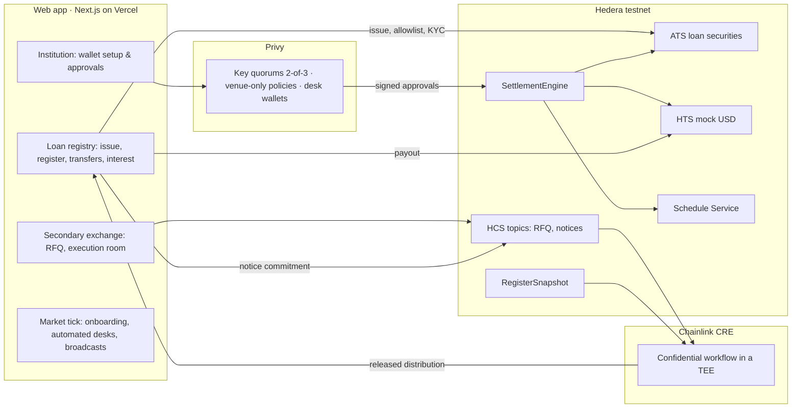

# SyndicateLend

[](https://github.com/queenleoa/SyndicateLend/actions/workflows/ci.yml)

**A private tokenised register and RFQ secondary market for syndicated-loan interests on Hedera.** A loan trade settles as one atomic, compliance-checked transaction instead of a weeks-long reconciliation, and interest is calculated from confidential terms with a public proof.

| | |
|---|---|
| **Live demo** | <https://syndicatelend.fullmetal.finance> · sign in with any email and you get your own institution |
| **Demo video & ETHGlobal showcase** | <https://ethglobal.com/showcase/syndicatelend-dd17h> |
| **Pitch, deck, spec** | [PITCH.md](PITCH.md) · [docs/deck.md](docs/deck.md) · [HACKATHON-PRD.md](HACKATHON-PRD.md) (full spec; status at submission in §8.5; detailed engineering record in §14) |

Built by the founder of [Fullmetal Finance](https://fullmetal.finance) (collateral and settlement-efficiency products for institutional finance) for the Hedera hackathon, ATS track.

## The problem

A syndicated loan has one borrower, one credit agreement and many lenders. Selling a lender's position is an assignment: documents, eligibility checks and consents must complete before the administrative agent records the new lender, and the cash moves on a separate rail. Agreeing a price is not the same as completing the transfer.

**Only 29% of par loan trades settled within T+7; 27% took longer than T+20** ([LSTA](https://www.lsta.org/university/operations/)). Sellers wait for proceeds, both sides carry non-performance risk, and daily-redemption funds carry a liquidity mismatch.


SyndicateLend tokenises the **assignment itself on the agent's register** (not exposure behind a fund wrapper) and brings the register and the payment into one controlled transaction. Fast execution begins *after* the required consents and approvals; tokenisation does not waive them.

## What it does

1. **Register.** One credit agreement, one Asset Tokenization Studio (ATS) security per facility or tranche, issued from the ops scripts or from the browser wizard. 1 token = US$1 par. Whitelist and time-bound internal KYC on the token: a transfer to an unverified account reverts.
2. **Market.** The RFQ workflow desks already use, with every event ordered on a Hedera Consensus Service topic and an agent-bank consent step before settlement.
3. **Institutional approval.** Every desk wallet is a Privy key quorum, 2 of 3, under a policy limited to the venue contracts. One signature does nothing; the app secret alone can never move assets.
4. **Atomic settlement.** `SettlementEngine` exchanges loan tokens and mock USD in one call, scheduled through the Hedera Schedule Service from inside the contract. Eligibility is re-checked at execution: a buyer revoked after approval causes a full revert with the reason on-chain.
5. **Confidential interest.** The agent commits a salted hash of its private rate notice to HCS; a Chainlink CRE confidential workflow verifies it in a TEE, computes every holder's accrual and releases only the distribution; the paying agent settles it in atomic HTS transfers.

## Architecture



The app has four workspaces: **Institution** (Privy wallet, approval policy, wallet setup as three phases), **Loan registry** (the agent bank's view: issue an asset, the register, transfer requests, interest and payments, administration), **Secondary exchange** (execution room, RFQ trading, desk approvals) and **Positions**. A market tick runs after any API response, so the hosted demo needs no long-lived process.

## What each sponsor's stack does here

| Stack | Used for |
|---|---|
| **Hedera ATS** | One bond-type security per facility or tranche, deployed through the ATS factory; whitelist control list, internal time-bound KYC, issuer and controller roles; `transferFrom` at settlement so compliance is re-checked (never `forcedTransfer`) |
| **Hedera HTS** | Mock USD payment leg with KYC, freeze and pause keys held by the agent; HIP-719 association from Privy wallets; atomic multi-party interest payouts |
| **Hedera HCS** | RFQ, quote, acceptance, consent and settlement receipts as ordered messages; salted rate-notice commitments and payout receipts |
| **Hedera Smart Contracts + Schedule Service** | `SettlementEngine` (Sourcify-verified) stores instructions, collects both approvals and schedules its own `settle` via HIP-1215 `scheduleCall`, paying for the execution itself; `RegisterSnapshot` returns every holder's balance in one call for the enclave |
| **Chainlink CRE** | Confidential workflow (`handlerInTee`): fetch the private notice with a Vault DON secret, verify it against the HCS commitment, read the register snapshot, release only per-holder amounts; a tampered notice aborts the run |
| **Privy** | Email or Google login; one key quorum per institution (named staff, or trader + automated compliance co-signer + reserve key for self-service desks); policies that allow only the venue contracts on chain 296; intents signed in the browser with each member's user key |

## Live on Hedera testnet

| Artefact | Id | Inspect |
|---|---|---|
| Term Loan B Tranche A `MHTLB-A` (ATS security, wired to the secondary market) | `0.0.10459721` / `0x1600f4a4609b9e9c48c432a16732da2634b7b1b7` | [HashScan](https://hashscan.io/testnet/contract/0.0.10459721) |
| Revolving Credit Facility `MH-RCF` (ATS security, 60,000,000 par) | `0.0.10520474` / `0xbfb63219860760f570723ee1dba9873cd9723f7f` | [HashScan](https://hashscan.io/testnet/contract/0.0.10520474) |
| Delayed Draw Term Loan `MH-DDTL` (ATS security, 40,000,000 par) | `0.0.10520523` / `0x715d682dc4bd7e73a1919b6929361bc771c6b348` | [HashScan](https://hashscan.io/testnet/contract/0.0.10520523) |
| Tranches issued from the browser wizard (`MHTLB-B`, `MHTLB-C`, …) | recorded per issuance | listed with receipts on the Loan register |
| SettlementEngine (Sourcify exact match) | `0.0.10460134` / `0x593D401cF80FAE8422a5aA113075cD2F464c297F` | [HashScan](https://hashscan.io/testnet/contract/0.0.10460134) |
| RegisterSnapshot | `0x33687eBC6C3f8A89DbE60ADc3E631149dA6E0690` | [HashScan](https://hashscan.io/testnet/contract/0x33687eBC6C3f8A89DbE60ADc3E631149dA6E0690) |
| Mock USD (HTS, KYC / freeze / pause keys) | `0.0.10459660` | [HashScan](https://hashscan.io/testnet/token/0.0.10459660) |
| HCS RFQ topic | `0.0.10459663` | [HashScan](https://hashscan.io/testnet/topic/0.0.10459663) |
| HCS notice-commitment topic | `0.0.10459666` | [HashScan](https://hashscan.io/testnet/topic/0.0.10459666) |
| Administrative agent (operator) | `0.0.10457020` | [HashScan](https://hashscan.io/testnet/account/0.0.10457020) |

Two settlement scenarios are on-chain: a US$5m trade **settled atomically** by the network's scheduled call ([schedule 0.0.10460165](https://hashscan.io/testnet/schedule/0.0.10460165)), and a trade that **failed as a whole** after the buyer's eligibility was revoked between approval and execution, reason `AccountIsBlocked(buyer)` stored on-chain ([schedule 0.0.10460221](https://hashscan.io/testnet/schedule/0.0.10460221)). Interest for a 30-holder period was computed in the enclave and paid in four atomic HTS batches ([HCS #8](https://hashscan.io/testnet/topic/0.0.10459666)). The full evidence tables are in [HACKATHON-PRD.md §14](HACKATHON-PRD.md#14-engineering-record-moved-from-the-readme).

## Try the hosted demo

1. Sign in at <https://syndicatelend.fullmetal.finance> with any email. You get your own institution with a Privy quorum wallet; the agent bank funds it, lists it on the register and allocates US$10m par by itself.
2. **Institution:** sign the three wallet permissions once. The automated compliance co-signer completes each quorum.
3. **Loan registry → Issue an asset:** create a new ATS security under the credit agreement, allocate the syndicate, watch every Hedera receipt. It appears at the top of the Loan register.
4. **Transfer requests:** create a demo transfer, review it and approve it as the agent bank; both automated institutions sign and the Schedule Service settles it.
5. **Secondary exchange:** publish an RFQ or quote Aldgate's; approve your side once; the settlement lands about three minutes after the quote.
6. **Interest & payments:** the released distribution, payout receipts and the tamper-test evidence per asset.

Step-by-step scripts: [docs/loan-registry-demo.md](docs/loan-registry-demo.md), [docs/issuance-guide.md](docs/issuance-guide.md), [docs/demo-runbook.md](docs/demo-runbook.md).

## Run it locally

Prerequisites: Node 20+, Foundry, a Hedera **testnet ECDSA** account with HBAR (<https://portal.hedera.com>), a Privy app.

```bash
cp .env.example .env            # operator account, Privy app, automation keys; see comments in the file
npm install                     # workspaces: ops, web
cd contracts && forge install foundry-rs/forge-std OpenZeppelin/openzeppelin-contracts@v5.1.0 --no-git && forge test && cd ..

cd web && npm run dev           # http://localhost:3000 (uses ../.env)
```

Everything on chain is reproducible from the committed ids in `ops/deployments/testnet.json` without a login:

```bash
npm run demo:cre                                   # confidential accrual simulation for every asset (+ tamper run)
npm run demo:payout -- --facility MHTLB-A          # pay the released distribution in atomic HTS batches (--catch-up for skipped holders)
npm run demo:controls                              # HTS freeze / pause and ATS pause, with real failing transactions
npm run demo:feeder -- --holders 25 --par 1000     # retail feeder holders as public-network accounts on the register
npm run agent:reconcile -- --attest                # reconcile the agent's register export, attest the report hash on HCS
npm run agent:export                               # LSTA-vocabulary assignment export of every trade
npm run typecheck && npm run lint && npm run contracts:test
```

The Day-1 deployment order (mock USD, topics, engine, issuance, onboarding, allocation, settlement demos) is in [HACKATHON-PRD.md §14.5](HACKATHON-PRD.md#145-day-1-run-order-hedera-foundation). Hosting on Vercel needs an Upstash Redis store seeded from the local records: [docs/demo-runbook.md](docs/demo-runbook.md#hosting-checklist-vercel). CI runs the 21 Foundry tests, typecheck, lint and the 36 TypeScript unit tests on every push.

## Repository layout

| Path | Contents |
|---|---|
| `contracts/` | Foundry project: `SettlementEngine.sol`, `RegisterSnapshot.sol`, HSS interface, tests with ATS/HTS/HSS doubles |
| `ops/` | Administrative-agent scripts (ATS SDK + Hedera SDK): issuance, KYC, allocation, mock USD, HCS topics, settlement demos, payout, controls, feeder, reconciliation, export |
| `ops/deployments/testnet.json` | Every address and id the scripts wrote, committed so judges can inspect |
| `web/` | Next.js 16 app: Institution, Loan registry, Secondary exchange, Positions; `web/src/lib/` holds the venue logic (Privy intents, onboarding, market tick, issuance, register) |
| `web/scripts/` | Provisioning, Hedera onboarding by hand, one market tick, hosted-store seeding, and the unit tests (`*.test.mts`) |
| `cre/` | Chainlink CRE confidential workflow and the demo runner; `cre/evidence/` holds sanitised per-asset distributions and payout receipts |
| `docs/` | Deck, demo runbook, registry walkthrough, issuance guide, wallet-setup recovery, Privy dashboard checklist, validation record, lean canvas |
| `.github/workflows/ci.yml` | forge test, typecheck, lint, unit tests |

## Further reading

- [HACKATHON-PRD.md](HACKATHON-PRD.md): problem and market, product definition, user journeys, requirements and status (§8.5), privacy and security model, business model, and the engineering record (§14): settlement evidence, Day-1 run order, ATS SDK from Node, Privy approvals and nonce handling, CRE workflow and payout, lifecycle controls, integration hooks, network impact and the retail feeder results, and the fallbacks adopted in the demo.
- [docs/validation.md](docs/validation.md): dated observation → evidence → decision log from the testnet build.
- [docs/lean-canvas.md](docs/lean-canvas.md) and [PITCH.md](PITCH.md): business model and the ask.
